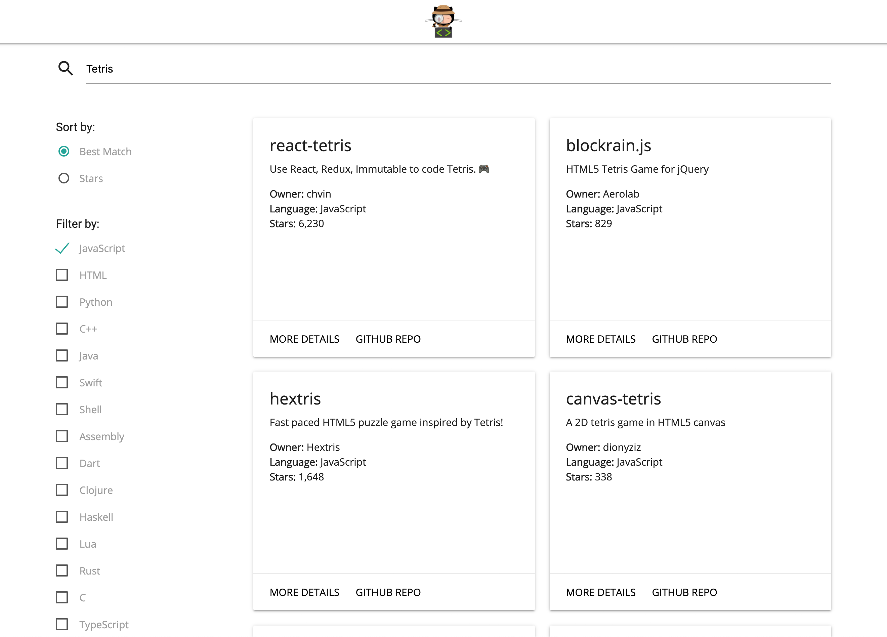

# GitHub Search
GitHub Search - Find what you're looking for

Deployed using GitHub pages: https://nicchappell.github.io/github-search/



## Installation

```
git clone https://github.com/NicChappell/github-search.git

...

cd github-search
npm install

...

npm start
```

## Usage

* Enter a search term into the input field
  * Search term must be greater than 4 characters and less than 32 characters
  * Only alpha-numeric, '-' and '_' characters are allowed
* Search results can be sorted by best match (default behavior) or by number of stars
* Search results can be filtered by the repo's primary language
* Each search result has an option to view more details about the repo and a direct GitHub link

## Highlights

* React App created and configured using create-react-app
* The application consists of 3 routes
  * Search: Submit query to GitHub Search API and navigate the response
  * Details: Detailed information about a single response element
  * No Match: Catch-all for undefined routes
* Materialize CSS framework used to provide a responsive grid structure and pre-defined components and styles
* React Router used to enable dynamic routing
* Axios used for easy HTTP requests
* Moment used for datetime formatting
* Lodash used for reliable utility functions
